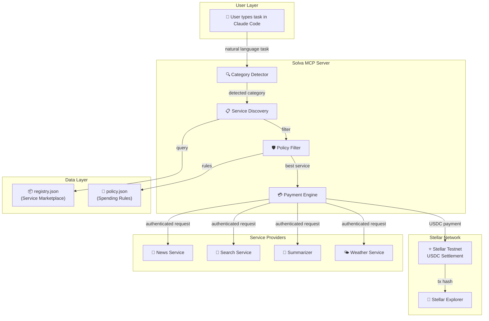
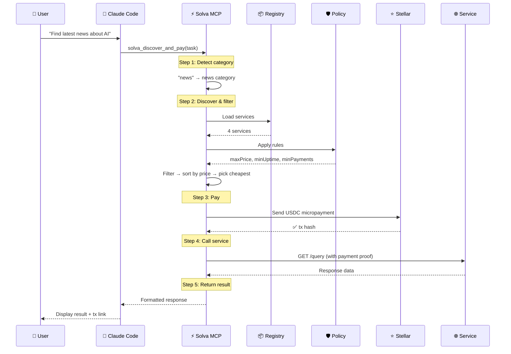
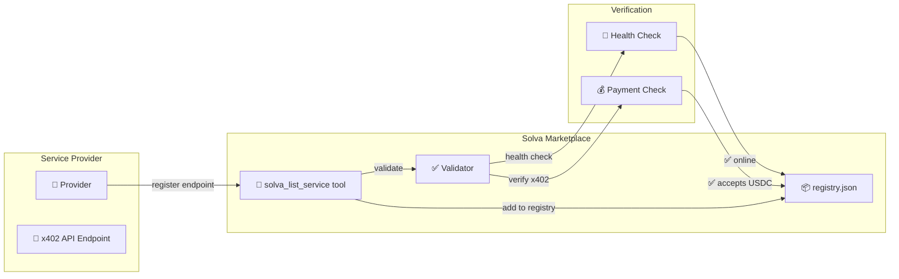
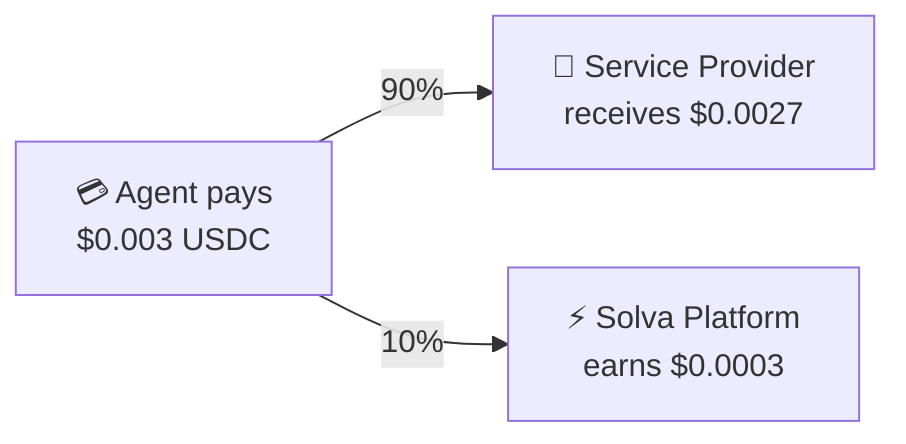
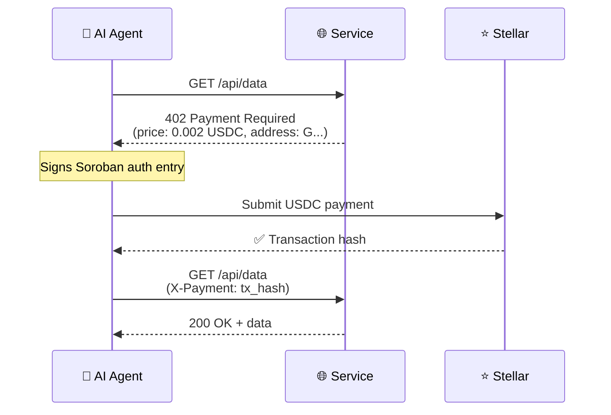

# 🧠 Solva MCP

**The AI-native marketplace where agents discover, pay, and consume services autonomously.**

Solva MCP is a Model Context Protocol (MCP) server that turns Claude Code into an autonomous service consumer. It gives AI agents the ability to **discover services**, **evaluate them against policies**, and **pay with real USDC micropayments on Stellar** — all in a single natural language command.

> **Built for:** [Stellar Hacks: Agents Hackathon](https://stellar.org)  
> **Protocol:** [x402](https://x402.org) — HTTP 402 micropayments on Stellar  
> **Network:** Stellar Testnet (real on-chain transactions)

---

## 🎯 What Problem Does Solva Solve?

Today, AI agents are trapped behind **API keys**, **subscriptions**, and **pre-negotiated contracts**. If an agent needs data from a service it hasn't been pre-configured to use, it simply can't.

**Solva changes this.** It creates an open marketplace where:

| Role | Today (Broken) | With Solva (Fixed) |
|---|---|---|
| **AI Agent** | Needs API keys, subscriptions, manual setup | Discovers and pays for any service on demand |
| **Service Provider** | Must onboard each customer manually | Lists service once, gets paid per request automatically |
| **Platform** | Takes monthly subscriptions | Earns a commission on every micropayment |

---

## 🏗️ Architecture

### System Overview



### Request Flow (Step by Step)



---

## 🔄 Two-Sided Marketplace

Solva is not just a discovery tool — it's a **two-sided marketplace** for AI agent services.

### Side 1: Service Discovery (Implemented ✅)

AI agents discover and pay for services automatically:

```
User: "Summarize blockchain payment trends"
  → Solva detects category: summarize
  → Finds Brevity Summarizer ($0.001 USDC, 97.8% uptime)
  → Pays on Stellar testnet
  → Returns summary
```

### Side 2: Service Listing (Roadmap 🗺️)

Service providers register their x402-enabled endpoints in the marketplace:



**How listing will work:**

1. Service provider deploys an x402-protected API endpoint
2. Provider calls `solva_list_service` with their endpoint URL, category, and pricing
3. Solva validates the endpoint:
   - ✅ Health check (is it online?)
   - ✅ x402 check (does it return HTTP 402 with valid payment requirements?)
   - ✅ Stellar check (does it accept USDC on Stellar?)
4. If validated, the service is added to `registry.json`
5. AI agents can now discover and pay for it automatically

**Current state:** In this hackathon demo, the registry is pre-populated with 4 services to demonstrate the discovery and payment flow. The listing mechanism is the natural next step.

---

## 💰 Revenue Model

Solva operates as a **marketplace with commission-based revenue**:



| Revenue Stream | Description | Status |
|---|---|---|
| **Platform Commission** | 10-20% fee on every micropayment routed through Solva | Roadmap |
| **Premium Listings** | Service providers pay for featured placement in registry | Roadmap |
| **Policy Templates** | Enterprise customers pay for custom policy configurations | Roadmap |

> **Hackathon demo:** The current implementation sends the full payment amount as a testnet self-transfer to demonstrate real on-chain transactions. In production, the payment would be split between the service provider and the Solva platform via a Soroban smart contract.

---

## 📦 Service Registry

The registry currently includes 4 services across different categories:

| Service | Category | Price | Uptime | Payments | Policy Status |
|---|---|---|---|---|---|
| XLM News Wire | 📰 news | $0.002 | 99.2% | 1,400 | ✅ Passes |
| DeepQuery Search | 🔎 search | $0.003 | 98.5% | 750 | ✅ Passes |
| Brevity Summarizer | 📝 summarize | $0.001 | 97.8% | 180 | ✅ Passes |
| SkyVault Weather | 🌤️ weather | $0.004 | 95.5% | 45 | ❌ Fails |

**Why does SkyVault Weather fail?** The policy requires:
- `minUptimePct: 97.0` → SkyVault has 95.5% ❌
- `minTotalPayments: 100` → SkyVault has only 45 ❌

This demonstrates that Solva **protects agents from unreliable or untrusted services**.

---

## 🛡️ Policy Engine

The policy engine lets agent operators define spending rules:

```json
{
  "maxPriceUSDC": 0.005,      // Never pay more than $0.005 per request
  "minUptimePct": 97.0,        // Only use services with 97%+ uptime
  "minTotalPayments": 100,     // Only use services with 100+ successful payments
  "dailyBudgetUSDC": 2.0,      // Don't spend more than $2/day
  "allowExplorer": false        // Don't expose transaction details
}
```

This gives enterprises **full control** over how their AI agents spend money — preventing runaway costs and ensuring quality.

---

## ⚡ How x402 Payment Works

The [x402 protocol](https://x402.org) enables machine-to-machine micropayments using HTTP status code 402:



**Key properties:**
- **No API keys needed** — payment IS the authentication
- **No subscriptions** — pay per request, as little as $0.001
- **Instant settlement** — Stellar confirms in 3-5 seconds
- **On-chain proof** — every payment is verifiable on the blockchain

---

## 🚀 Quick Start

### Prerequisites

- Node.js 20+
- A Stellar testnet wallet funded with XLM and USDC
- Claude Code (claude CLI)

### 1. Clone & Install

```bash
git clone https://github.com/raunet234/solva-mcp.git
cd solva-mcp
npm install
```

### 2. Configure Environment

```bash
cp .env.example .env
```

Edit `.env` and add your Stellar testnet secret key:
```
STELLAR_SECRET_KEY=S...your_testnet_secret_key...
```

### 3. Fund Your Wallet

1. **Get testnet XLM:** Visit [Stellar Friendbot](https://laboratory.stellar.org/#account-creator?network=test)
2. **Get testnet USDC:** Visit [Circle Faucet](https://faucet.circle.com/) → select Stellar Testnet → paste your public key

### 4. Add to Claude Code

```bash
claude mcp add solva npx tsx /absolute/path/to/solva-mcp/src/index.ts -e STELLAR_SECRET_KEY=your_key
```

Or add to your MCP config file:

```json
{
  "mcpServers": {
    "solva": {
      "command": "npx",
      "args": ["tsx", "/absolute/path/to/solva-mcp/src/index.ts"],
      "env": {
        "STELLAR_SECRET_KEY": "your_key_here"
      }
    }
  }
}
```

### 5. Use It

```
> Call solva tool: find latest news about AI
> Call solva tool: summarize blockchain payment trends
> Call solva tool: research x402 protocol
```

---

## 🎬 Demo Output

When you call the tool, you get a structured response with full payment transparency:

```
✓ Task: find latest news about Notion
✓ Category: news
✓ Service: XLM News Wire (https://mock-news.agentpay.dev/query)
✓ Price: $0.002 USDC
✓ Transaction: 7c2ef38eff2ac7423dab1faf4a009e72c2bb982e...
✓ Explorer: https://stellar.expert/explorer/testnet/tx/7c2ef38e...

Top stories:
1. "Stellar Network Hits 10M Daily Transactions" — CoinDesk, April 12 2026
2. "x402 Protocol Sees 300% Growth in Agent Micropayments" — The Block, April 11 2026
3. "Soroban Smart Contracts Now Power 40% of DeFi Volume" — Decrypt, April 10 2026
```

Every transaction is **real and verifiable** on the [Stellar Testnet Explorer](https://stellar.expert/explorer/testnet).

---

## 📁 Project Structure

```
solva-mcp/
├── src/
│   ├── index.ts          ← MCP server + tool registration
│   ├── helpers.ts         ← Category detection, filtering, mock results
│   ├── payment.ts         ← Direct Stellar USDC payment for mock services
│   └── stellar/           ← Vendored Stellar x402 implementation
│       ├── constants.ts
│       ├── signer.ts
│       ├── shared.ts
│       ├── utils.ts
│       └── exact/         ← ExactStellarScheme (client/server/facilitator)
├── registry.json          ← Service marketplace (4 services)
├── policy.json            ← Agent spending rules
├── scripts/
│   └── setup-trustline.ts ← One-time USDC trustline setup
├── .env.example
├── package.json
├── tsconfig.json
└── README.md
```

---

## 🗺️ Roadmap

### Phase 1: Discovery & Payment (Current — Hackathon ✅)
- [x] Natural language → category detection
- [x] Policy-based service filtering
- [x] Real USDC micropayments on Stellar testnet
- [x] Structured response with tx proof

### Phase 2: Service Listing
- [ ] `solva_list_service` tool for providers to register endpoints
- [ ] Automated endpoint validation (health check + x402 verification)
- [ ] Dynamic registry updates (no restart needed)
- [ ] Service rating system based on agent feedback

### Phase 3: Platform Economics
- [ ] Smart contract for automatic payment splitting (provider + platform fee)
- [ ] Daily budget tracking and enforcement
- [ ] Multi-agent support (different policies per agent)
- [ ] Mainnet deployment with real USDC

### Phase 4: Open Marketplace
- [ ] Decentralized registry on Stellar/Soroban
- [ ] Service provider dashboard
- [ ] Analytics and reporting for providers
- [ ] Cross-chain support (Ethereum, Base via x402)

---

## 🔗 Links

- **Stellar Testnet Explorer:** [stellar.expert/explorer/testnet](https://stellar.expert/explorer/testnet)
- **x402 Protocol:** [x402.org](https://x402.org)
- **Reference Implementation:** [x402-mcp-stellar](https://github.com/jamesbachini/x402-mcp-stellar)
- **Circle USDC Faucet:** [faucet.circle.com](https://faucet.circle.com/)

---

## 📄 License

MIT
